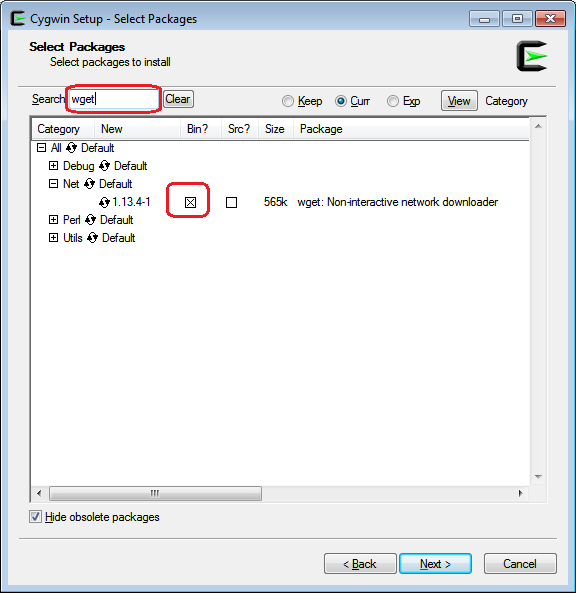

#Getting Started

## Video Tutorial

The video tutorial from fast.ai is available [here](http://course.fast.ai/lessons/aws.html).

##AWS CLI

Install Amazon AWS CLI tool. See full instructions [here](http://docs.aws.amazon.com/cli/latest/userguide/installing.html).

__Linux or OSX:__

    $ sudo pip install awscli

__Windows:__

    > pip install awscli

Verify your installation by running:

    $ aws --version

You should see something like:

    aws-cli/1.11.30 Python/2.7.10 Darwin/16.3.0 botocore/1.4.87

Configure AWS CLI with your Access Key, Secret Access Key & Region preference:

    $ aws configure

When prompted for default region type `us-east-1` and for default output format type `text`. If you do not have an Access Key and Secret Access key, follow the instructions [here](http://docs.aws.amazon.com/IAM/latest/UserGuide/id_credentials_access-keys.html#Using_CreateAccessKey).

##Anaconda (Python)

Download Anaconda from [here](https://www.continuum.io/downloads). Make sure you pick the Python 2.7 Installer.

##Cygwin (Windows only)

If you are using Windows, you will need a Bash shell. The easiest solution is to install Cygwin from [here](https://cygwin.com/install.html). Make sure when you install that you ensure the `wget` package is included:

##Fast.ai Scripts

Navigate to the `setup` directory:

    $ cd setup

Add the aliases:

    $ source aws-alias.sh

Optionally, if you want to have this auto load, and not have to run each time you open a new terminal, first determine your current path (make sure you are currently in the `setup` folder):

    $ pwd

This will output the full path to your `setup` folder, example:

    /Users/xxxx/GitHub/courses/setup

For Windows/linux edit `~/.bashrc`, for OSX edit `~/.bash_profile`  :    

    $ nano .~/bashrc

    or

    $ nano .~/bash_profile

then add a line at the bottom, including the output from `pwd` above, example:

    source /Users/xxxx/GitHub/courses/setup/aws-alias.sh

Reload your terminal (quit and re-open), and you should find the aliases work without having to run source again.    

##Create an Instance

Run the following command from the `setup` directory to start a new instance (this will take a minute or so):

    $ bash setup_p2.sh

You should now see the instance within the AWS Console ([https://console.aws.amazon.com](https://console.aws.amazon.com)):

  

__Note: Make sure you stop the instance when not in use, as the cost is $0.90 per hour__

By running `setup_p2.sh` you will now have 2 new files in your setup directory, `fast-ai-commands.txt` and `fast-ai-remove.sh`. `fast-ai-commands.txt` contains a handy list of commands specifically for your instance. `fast-ai-remove.sh` is used to terminate your instance.

##Get your instance details

You will need the instance IP address later when running Jupyter Notebook. Run the following commands to print the IP to the terminal:

    $ aws-get-p2
    $ aws-ip

Save the IP address returned (xxx.xxx.xxx.xxx)

##Connect to your instance

    $ aws-get-p2
    $ aws-ip
    $ aws-ssh

When prompted to confirm authenticty, type `yes`.

##Perform Updates

It's always a good idea to perform regular updates on any server. Since this instance is built from an AMI (Amazon Machine Image) the software (and security updates) will always be slightly out of date. Upon login you will see a message like this:

    174 packages can be updated.
    88 updates are security updates.

To update your server run:

    $ sudo apt-get update
    $ sudo apt-get upgrade

The `upgrade` command will take a few minutes to run.

If you run into an error saying `E: Could not get lock /var/lib/dpkg/lock - open (11: Resource temporarily unavailable)` (as I did with the current AMI), run:

    $ sudo rm /var/lib/apt/lists/lock
    $ sudo rm /var/cache/apt/archives/lock
    $ sudo rm /var/lib/dpkg/lock
    $ sudo apt-get update
    $ sudo dpkg --configure -a

Then try again with:

    $ sudo apt-get update
    $ sudo apt-get upgrade

Hit enter when asked if you want to continue.

After upgrading, reboot the instance:

    $ sudo reboot

Wait a minute, and then reconnect:

    $ aws-ssh

**Note:** if you see a timeout error, wait another minute for the reboot to complete and then try `aws-ssh` again.

##Test the GPU is available

    $ nvidia-smi

You should see something like this:

    Thu Jan 19 23:40:32 2017
    +-----------------------------------------------------------------------------+
    | NVIDIA-SMI 367.57                 Driver Version: 367.57                    |
    |-------------------------------+----------------------+----------------------+
    | GPU  Name        Persistence-M| Bus-Id        Disp.A | Volatile Uncorr. ECC |
    | Fan  Temp  Perf  Pwr:Usage/Cap|         Memory-Usage | GPU-Util  Compute M. |
    |===============================+======================+======================|
    |   0  Tesla K80           Off  | 0000:00:1E.0     Off |                    0 |
    | N/A   36C    P0    72W / 149W |      0MiB / 11439MiB |     67%      Default |
    +-------------------------------+----------------------+----------------------+

    +-----------------------------------------------------------------------------+
    | Processes:                                                       GPU Memory |
    |  GPU       PID  Type  Process name                               Usage      |
    |=============================================================================|
    |  No running processes found                                                 |
    +-----------------------------------------------------------------------------+

##Install required software

You need to install some additional software on the instance, run:

    $ sudo apt-get install unzip

##Start Jupyter Notebook

Jupyter Notebook is the application used to run

    $ jupyter notebook

You should see (after a few seconds) an output like this:

    [I 00:07:47.413 NotebookApp] [nb_conda_kernels] enabled, 2 kernels found
    [I 00:07:47.417 NotebookApp] Writing notebook server cookie secret to /run/user/1000/jupyter/notebook_cookie_secret
    [W 00:07:47.999 NotebookApp] WARNING: The notebook server is listening on all IP addresses and not using encryption. This is not recommended.
    [I 00:07:48.084 NotebookApp] ✓ nbpresent HTML export ENABLED
    [W 00:07:48.084 NotebookApp] ✗ nbpresent PDF export DISABLED: No module named nbbrowserpdf.exporters.pdf
    [I 00:07:48.089 NotebookApp] [nb_conda] enabled
    [I 00:07:48.188 NotebookApp] [nb_anacondacloud] enabled
    [I 00:07:48.191 NotebookApp] Serving notebooks from local directory: /home/ubuntu
    [I 00:07:48.191 NotebookApp] 0 active kernels
    [I 00:07:48.191 NotebookApp] The Jupyter Notebook is running at: http://[all ip addresses on your system]:8888/
    [I 00:07:48.191 NotebookApp] Use Control-C to stop this server and shut down all kernels (twice to skip confirmation).

Connect to Jupyter Notebook in your browser by pasting the IP address of the instance (that you saved earlier) followed by :8888, for example:

    http://xx.197.204.xx:8888/

You should see a password prompt. Enter `dl_courses` and click `Log In`.

##Stop the Instance (to save money)

You should __always__ stop the instance after use to avoid large costs accruing within your AWS account. Use the following command to stop your instance:

    $ aws-stop

If this does not work, simply login to the AWS console, right click on the EC2 Instance, select: Instance State > Stop.

Once stopped, you will no longer be charged for the instance, however you will be charged for the EBS volume (disk drive). This is roughly $0.05 per GB per month. The attached volume to the instance (created by `setup_p2.sh` is 128GB (roughly $6.40 per month).

##Restart the Instance

To start a stopped instance use:

    $ aws-start

If you have closed your terminal since you last used the instance, the alias and ID might not be saved, and you will see an error like this:

    -bash: aws-start: command not found

To fix, simply reload the aliases and instance details:

    $ cd setup
    $ source aws-alias.sh
    $ aws-get-p2

Then you can retry running:

    $ aws-start

##Destroy the Instance (in case you need to)

    $ bash fast-ai-remove.sh

If this does not work, simply login to the AWS console, right click on the EC2 Instance, select: Instance State > Terminate.
